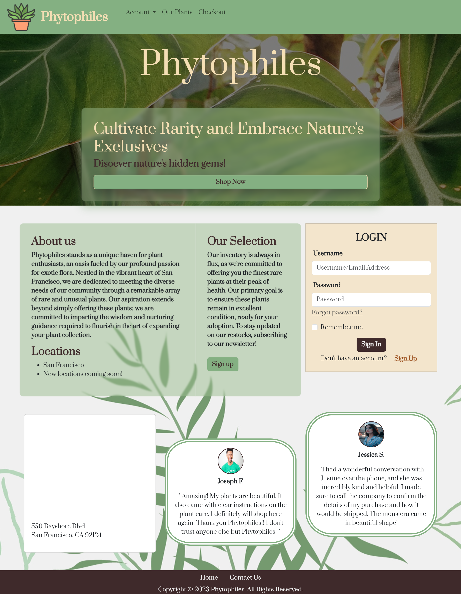
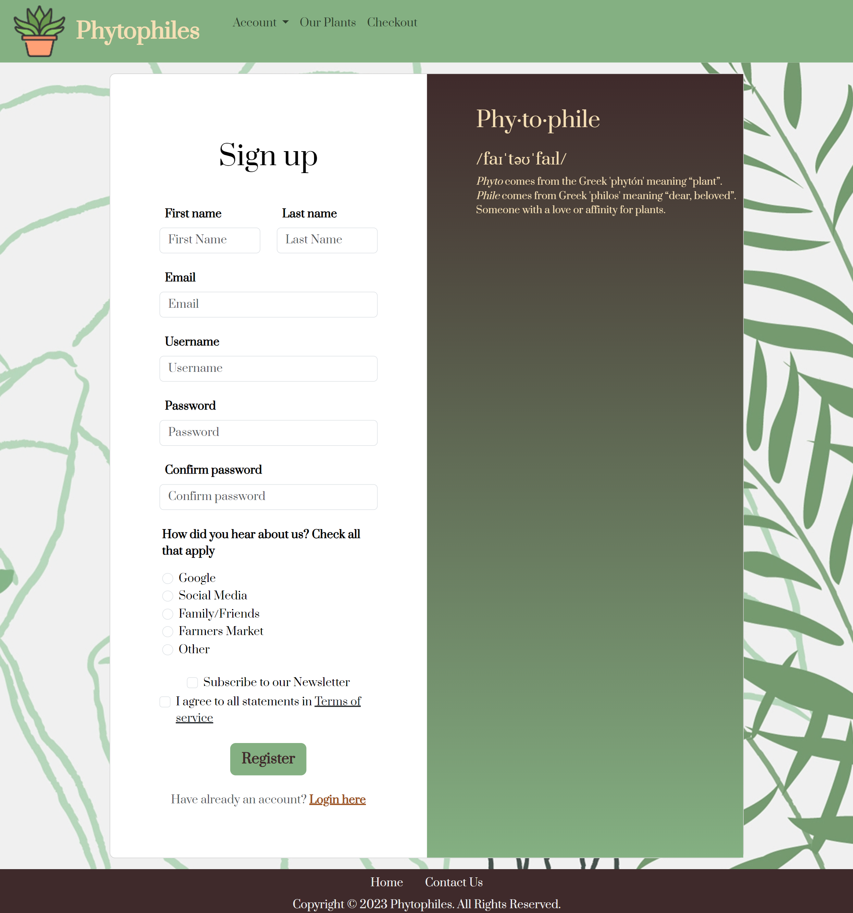
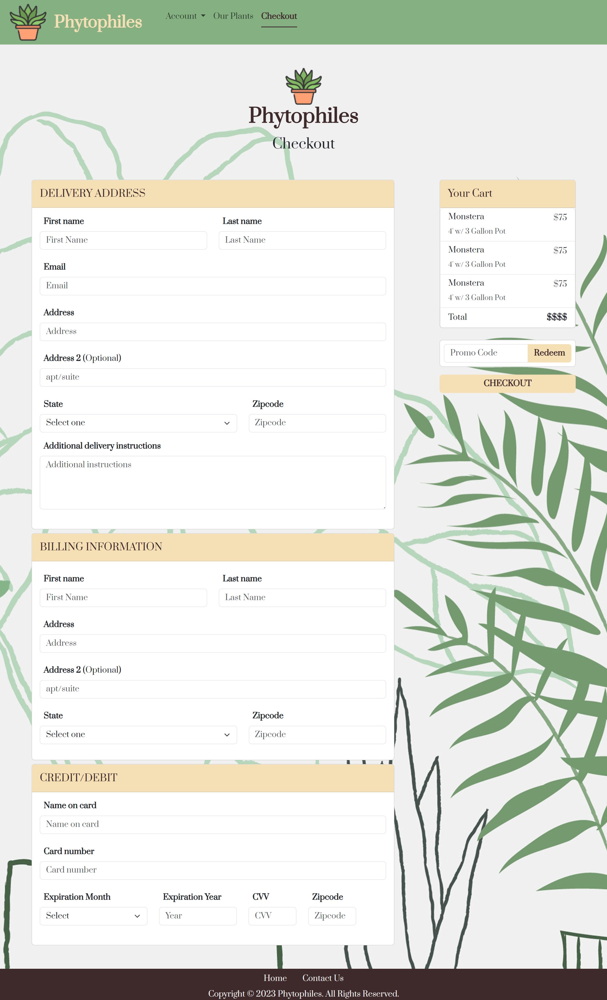
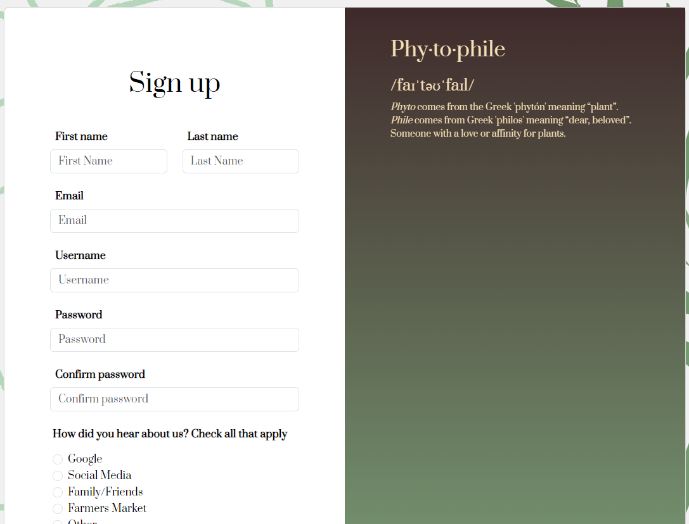
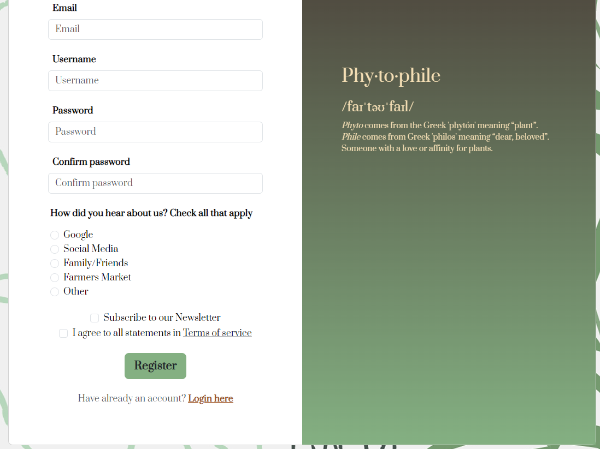

# Phytophiles Plant Shop
E-commerce Website

This is meant to be a usable e-commerce site for a rare plant shop. It allows customers to easily navigate through site, aiming to catch their attention to shop and give their loyalty to this hop. It contains an index with a hero banner, registration page, login page, a product page, and a checkout page. It was built using HTML, CSS, and various elements from Bootstrap version 5.3.2. 

### Prerequisites

Knowledge of HTML / CSS / Bootstrap

## Built With

* [HTML](https://developer.mozilla.org/en-US/docs/Web/HTML)
* [CSS](https://developer.mozilla.org/en-US/docs/Web/CSS)
* [Javascript](https://developer.mozilla.org/en-US/docs/Web/JavaScript)

## Color Reference

| Color             | Hex                                                                |
| ----------------- | ------------------------------------------------------------------ |
| Anti-Flash White |  #F0F0F0 |
| Wheat |  #F5DFB5 |
| Leaf Green |  #84B082 |
| Sienna |  	#9D5220 |
| Old Burgundy |  	#3F2A2B |

## HTML
**Index**

**Products**

**Login**

**Registration**

**Checkout**

## Code Highlight
**Fixed Position**

I wanted my definition to stay on the users page, even after they scroll past where it starts upon loading. by uing postion-fixed within bootstrap (as seen below in the first div tag), that element will stay in the same position when you scroll up/down on the page.

**Code**

    

        

        <h2 class="mb-4 text-3">Phy·to·phile</h2>
        <h4 class="text-3"> /faɪˈtəʊˈfaɪl/</h4>
        
<em>Phyto</em> comes from the Greek 'phytón' meaning “plant”.  <em>Phile</em> comes from Greek 'philos'
            meaning “dear, beloved”.  Someone with a love or affinity for plants.

    

The images below display the Phytophile definition in the same position in different viewing positions.

**Exhibit A**

**Exhibit B**

## Deployed Link

https://justineelbuhel.github.io/PhytophilesShop/

## Authors

 **Justine Elbuhel** 

- https://github.com/JustineElbuhel
- https://www.linkedin.com/in/justine-elbuhel-/

## Acknowledgments

* Bootstrap v5.3
* Coolors.co
* Pluralsight Professor : Remsey Mailijard
* YearUp Peers